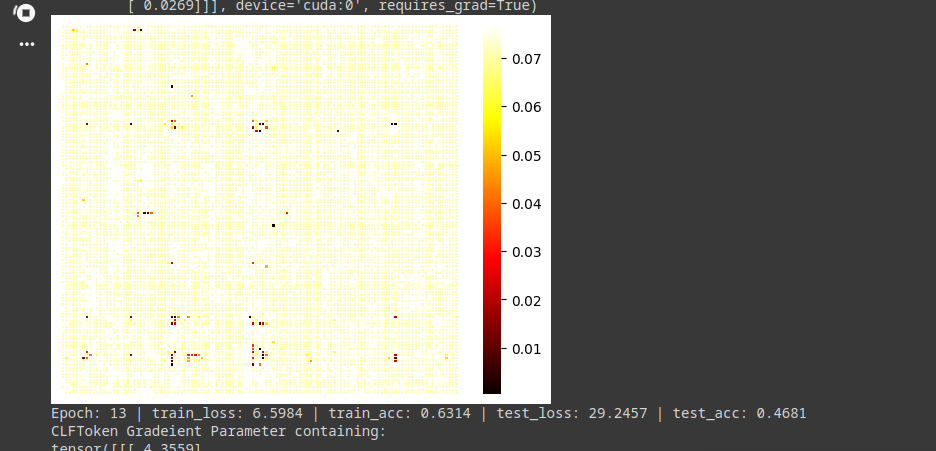
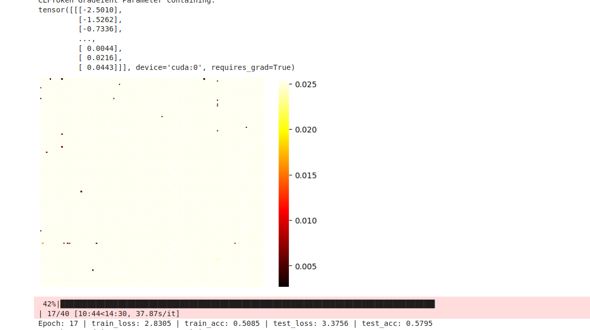

# Expriments

## Temporal First , No Conv , AdamW , Config.File:
    """ class CONFIG():

    def __init__(self,CLFTOKEN = True):
        self.CLFTOKEN = CLFTOKEN
        
        self.B = 2
        # Define Lenght of the Time-series
        # Define Number of the ROI
        self.T_prim , self.V = 1200 , 116
        # Define P & S Hyper-prameters that used to define numebrs of windows (1 <=P , S <= T_prim)
        self.P = 10
        self.S = 10
        # Define T (number of windows)
        self.T = math.floor((self.T_prim - self.P)/  self.S  ) + 1 
        # Define K_E (Use in Convolution Part of the Temporal attention)
        self.K_E = self.P 
        self.K_S = self.K_E * 2  # (Use in the Query & Key weight matrix)
        self.K_F = self.K_E * 2  # (Number of Outchannel of GCN)
        self.NUM_H = 5 # (Number of Head in Temporal Transformer )
        self.HIDDEN_DIM = 72 # Embed dim for the attention 
        if self.CLFTOKEN : 
            self.V = self.V + 1
        self.DROP_OUT = 0.0
        self.NUM_LAYER = 8
        self.NUM_CLASS = 2 """

        """LR = 0.1
           Pivot = 65
           Part = 1
           Epochs = 40
           save_weights = True
           optimizer = torch.optim.SGD(Model.parameters() , LR)
           loss_fn = torch.nn.CrossEntropyLoss()"""

## spatial First , + Conv , AdamW , Config.File:
    """ class CONFIG():

    def __init__(self,CLFTOKEN = True):
        self.CLFTOKEN = CLFTOKEN
        
        self.B = 2
        # Define Lenght of the Time-series
        # Define Number of the ROI
        self.T_prim , self.V = 1200 , 116
        # Define P & S Hyper-prameters that used to define numebrs of windows (1 <=P , S <= T_prim)
        self.P = 100
        self.S = 90
        # Define T (number of windows)
        self.T = math.floor((self.T_prim - self.P)/  self.S  ) + 1 
        # Define K_E (Use in Convolution Part of the Temporal attention)
        self.K_E = self.P 
        self.K_S = self.K_E * 2  # (Use in the Query & Key weight matrix)
        self.K_F = self.K_E * 2  # (Number of Outchannel of GCN)
        self.NUM_H = 5 # (Number of Head in Temporal Transformer )
        self.HIDDEN_DIM = 64 # Embed dim for the attention 
        if self.CLFTOKEN : 
            self.V = self.V + 1
        self.DROP_OUT = 0.0
        self.NUM_LAYER = 6
        self.NUM_CLASS = 2 """
        

Let's examine something : we have a new atlas that is our token. but in the confusion matrix 

## Change Conv layers to consider T as in_channels (B , T , V , P) and reduce P 
    """class CONFIG():

    def __init__(self,CLFTOKEN = True):
        self.CLFTOKEN = CLFTOKEN
        
        self.B = 2
        # Define Lenght of the Time-series
        # Define Number of the ROI
        self.T_prim , self.V = 1200 , 116
        # Define P & S Hyper-prameters that used to define numebrs of windows (1 <=P , S <= T_prim)
        self.P = 50
        self.S = 30
        
        # Define T (number of windows)
        self.T = math.floor((self.T_prim - self.P)/  self.S  ) + 1 
        ## Define Convulotion HyperParameters
        self.K_E = self.T  # Define K_E (Use in Convolution Part of the Temporal attention)
        self.KERNEL_1 = (1,self.P // 10)   # Kernel size for the first Conv 
        self.STRIDE_1 = (1,2)  # Stride for both Conv1 & Conv2
        self.P_1 = math.floor((self.P - self.KERNEL_1[1])/  self.STRIDE_1[1]  ) + 1  # Output of the first Conv
        self.KERNEL_2 = (1 , self.P_1 // 10)
        self.STRIDE_2 = (1,1)
        self.P_2 =  math.floor((self.P_1 - self.KERNEL_2[1])/  self.STRIDE_2[1]  ) + 1

        
        self.K_S = self.P_2 * 2  # (Use in the Query & Key weight matrix)
        self.K_F = self.P_2 * 2  # (Number of Outchannel of GCN)
        self.NUM_H1 = 1  # Num Head in temporal Attention
        self.NUM_H2 = 2  # Num Head in laster transformer layers
        self.HIDDEN_DIM = 128 # Embed dim for the attention 
        if self.CLFTOKEN : 
            self.V = self.V + 1
        self.DROP_OUT = 0.0
        self.NUM_LAYER = 10
        self.NUM_CLASS = 2"""
