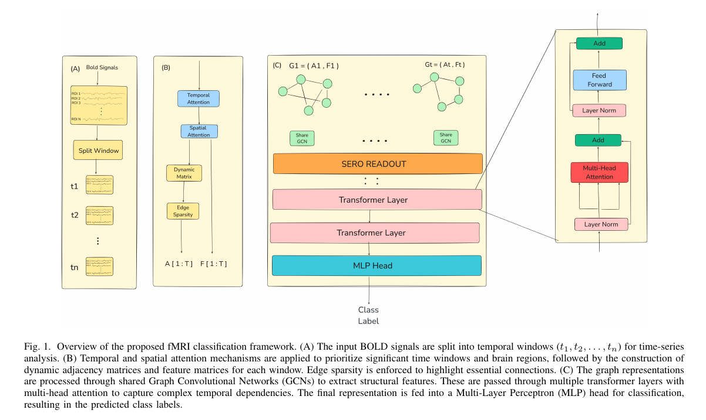

# fMRI Data Classification with Attention Mechanisms and Graph Neural Networks (GNN)

## Overview

This repository provides a deep learning framework for classifying fMRI data using a combination of temporal and spatial attention mechanisms, along with Graph Neural Networks (GNNs). The model analyzes fMRI data by splitting the signals into temporal windows, applying attention mechanisms, constructing dynamic graphs, and processing these graphs using Graph Convolutional Networks (GCNs) and transformers.

The key goal of this project is to improve the classification accuracy of brain states, particularly in tasks such as Autism Spectrum Disorder (ASD) classification.

## File Structure

- **AttentionArea.py**: Contains the implementation of the attention mechanisms, including both temporal and spatial attention blocks. These are essential for learning the dynamic relationships between brain regions across time windows.
  
- **Config.py**: Contains hyperparameters and configurations for the model, such as the number of windows (`T`), kernel sizes for convolutions, and the number of attention heads.
  
- **Dataset.py**: Implements custom dataset classes to handle fMRI data (e.g., ABIDE, ADHD datasets), loading the time-series data and the corresponding labels. It also includes functions for padding the sequences to a uniform size.
  
- **SplitWindows.py**: Contains the `SplitWindows` function that takes the fMRI data and splits it into temporal windows. These windows can be treated as individual graphs for further processing.
  
- **Train.ipynb**: A Jupyter notebook that orchestrates the training process, integrating all the components and training the model on the fMRI datasets.

## How It Works

### 1. Data Preprocessing
The raw fMRI data is first preprocessed to generate time-series sequences. The data is split into temporal windows, which are treated as individual graphs with spatial and temporal dependencies between brain regions.

### 2. Attention Mechanisms
The core of this model lies in two attention mechanisms:
- **Temporal Attention**: Focuses on the most relevant time windows.
- **Spatial Attention**: Highlights the most important brain regions.

### 3. Dynamic Graph Construction
Each time window is represented as a graph, where nodes correspond to brain regions and edges represent functional connectivity. The adjacency matrices are dynamically constructed using the attention scores.

### 4. Graph Convolutional Networks (GCNs) and Transformers
The dynamic graphs are processed using GCNs to capture structural features, followed by transformer layers to learn temporal dependencies across time windows.

### 5. Classification
The output from the transformers is passed through a Multi-Layer Perceptron (MLP) for final classification, allowing the model to predict the presence or absence of disorders such as ASD.

